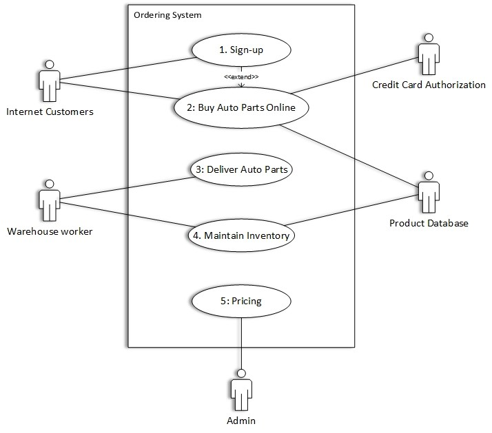
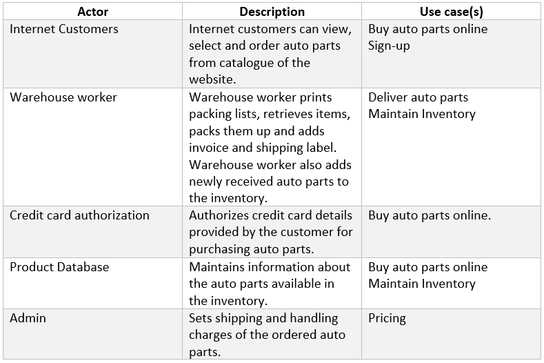

#Ordering System

**Ordering System** designed for the user who can place orders for the auto parts of his choice available in the database from the comfort of his couch. The user needs to provide few details and his credit card information when   he decides on what to buy from the company. An admin is assigned who   sets the shipping and handling charges for the auto parts ordered. When   the credit card details are authorized. The company ships the auto parts to   the customers. The warehouse worker controls the packing and shipping of   the auto parts.   The additional feature we are adding to the system is that, the customers   can register with our system and then all his details are saved in the   system and the user can purchase auto parts from the system without   having to provide his and credit card details all the time.

## Use Case Diagram   

## Actor Dictionary

